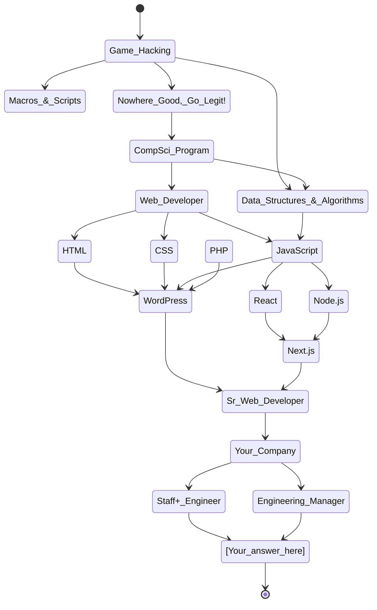

# David Elster's GitHub Profile

Watch this space, I hope to do cool stuff with it.

## Career Graph

I found out `gh` supports these diagrams, so I'm going to start using it to graph my path and skills.

## GitHub Suggestions

GitHub recommends I answer these prompts, so why not? Reach out if you have suggestions to add!

- 🔭 **I’m currently working on** building a knowledgebase from my experiences
- 🌱 **I’m currently learning** how to transition from Sr Web Developer to Staff+ Engineer or Engineer Manager 😉
- 👯 **I’m looking to collaborate on** quick projects with people trying to break into tech. You can do it! I can help!
- 🤔 **I’m looking for help with** finding my next role
- 💬 **Ask me about** the most stereotypical nerd stuff you can think to; I like sci-fi, mechanical keyboards, video games, etc
- 📫 **How to reach me:** [Reach out on Twitter!](https://twitter.com/messages/compose?recipient_id=1096136712890261505)
- 😄 **Pronouns:** I use `he/him`, but anything masc-neutral is acceptable 
- ⚡ **Fun fact:** Boo, that's a terrible question! Okay, I love to have 15min coffee chats with strangers. Reach out on Twitter and schedule one, I don't get enough 1:1s since the pandemic started. 
